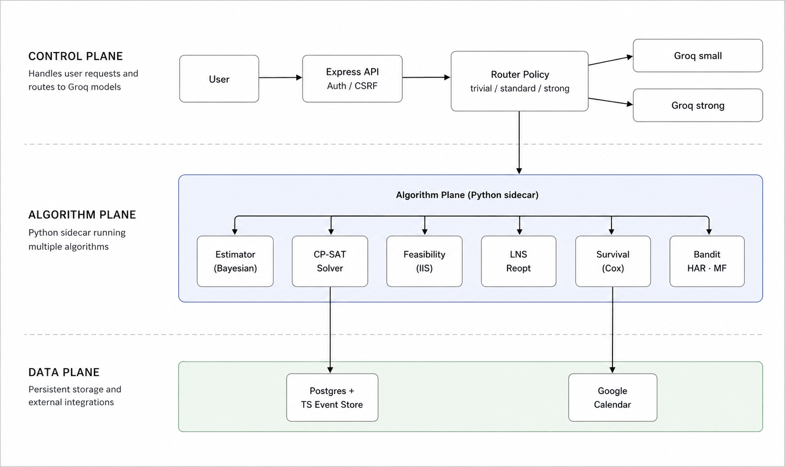

# Donna

## What inspired this

I'm a junior doing a double major, and outside class I'm handling 3 jobs, the internship hunt, 19 credits every semester, ML research, and cooking. A normal week has more moving parts than I can hold in my head.

So I tracked it badly, planned late at night, and missed deadlines.

I tried using an LLM to plan my week. It felt smart for a day. Then I noticed the schedules were wrong: two things in the same hour, work scheduled *after* its deadline. It wasn't reasoning about my week. It was generating text that looked like a plan. An LLM doesn't know whether a schedule is feasible. It just writes one that sounds plausible.

That's why Donna exists. Planning a semester isn't a language problem; it's a constraint problem.

## What it does

Everything.

You upload syllabi. Donna extracts deadlines, learns how long each type of assignment takes *you*, and builds a weekly schedule around classes, sleep, and non-negotiables. If you ask, "can I take Friday night off?", it re-solves and tells you exactly what breaks.

The LLM is still used, but only as a translator: it converts natural language into structured requests and explains solver output back to you. It does not make scheduling decisions.

## How I built it

Donna runs as a React + Express app with a Python algorithm sidecar.



Scheduling core (CP-SAT / MIP):

$$
\min \sum_k w_k \cdot \text{penalty}_k(x) \quad \text{s.t. hard feasibility constraints}
$$

Hard constraints enforce deadlines, sleep, and class windows. Soft penalties reduce late-night overload and context switching.

Time estimation is hierarchical Bayesian:

$$
\log(\text{hours}) \sim \mathcal{N}(\mu_u + \alpha_t + \beta_c + \gamma^\top x,\ \sigma^2)
$$

Cold start is handled by pooled priors; estimates personalize as completion data arrives.

If a request is infeasible, Donna runs IIS-style conflict extraction to return the *minimal* conflicting constraint set. Fast rescheduling uses large-neighborhood search. Additional modules include a Cox model (procrastination risk), Thompson sampling (notification timing), HAR forecasting (workload), and CRF-based syllabus extraction verification.

## What I learned

It is easy to *look* finished. Endpoints can return `200` while algorithmic behavior is still wrong.

In one audit, feasibility checks passed obviously impossible inputs because overflow was effectively unconstrained. Smoke tests passed, correctness failed.

I switched to explicit acceptance tests with numeric pass/fail criteria for each algorithm. "It returns something" is not evidence.

## The challenges

The hardest part was the audit-and-fix loop:

- feasibility logic that passed impossible inputs
- a reoptimizer that reshuffled everything instead of patching locally
- a router that sent most requests down one path

All of these built and linted cleanly before audit.

The other challenge was being honest about data-hungry models. Cox, bandit, and forecasting modules are real, but improve only after enough user history. The retraining loop exists; claims stay grounded.

## Replication

### 1) Prerequisites

- Node.js 20+
- npm 10+
- Python 3.11+
- Docker Desktop (recommended for full stack)
- Optional for local LLM mode: Ollama running on `http://localhost:11434`

### 2) Clone and install

```bash
git clone <your-repo-url>
cd donna
npm install
```

### 3) Configure environment

```bash
cp .env.example .env
```

Minimum required variables for local development:

- `SESSION_SECRET`
- `FRONTEND_ORIGIN`
- `SERVER_BASE_URL`
- `ALGO_SERVICE_BASE_URL`
- `POSTGRES_URL`
- `REDIS_URL`

Optional cloud LLM vars:

- `GROQ_API_KEY`
- `GROQ_MODEL`
- `GROQ_STRONG_MODEL`

Optional local LLM vars:

- `OLLAMA_BASE_URL` (default `http://localhost:11434`)
- `OLLAMA_MODEL` (default `gemma3:4b`)
- `OLLAMA_TIMEOUT_MS`

### 4) Run

Frontend + API:

```bash
npm run dev
```

Frontend + API + algorithm sidecar:

```bash
npm run dev:v2
```

Full Docker stack (Postgres + Redis + API + Algo + worker):

```bash
npm run dev:stack
```

### 5) Verify end to end

1. Open `http://localhost:5173`.
2. Sign in via `/login` (Google / Guest / Demo).
3. Go to dashboard and ask Donna to optimize a plan.
4. In chat header, switch provider mode (`Groq API` or `Local Server`).
5. Confirm status reflects route/provider and fallback state.

### 6) Run checks

```bash
npm run lint
npm run build
```

Algorithm tests:

```bash
cd algo-service
python -m pytest tests
```

Benchmark harness:

```bash
python scripts/benchmark-tokens.py
```

## API surface (current)

- `POST /api/donna/planner`
- `POST /api/v2/plan/solve`
- `POST /api/v2/plan/feasibility`
- `POST /api/v2/plan/reoptimize`
- `POST /api/v2/syllabus/ingest`

Provider metadata is returned on LLM-assisted routes:

- `providerUsed`
- `fallback`
- `fallbackReason`

## Security/public-repo hygiene

- `.env` is ignored.
- Local assistant/debug artifacts are removed from tracked source.
- Archived non-production files are kept in local `archive/` (gitignored).
- Before publishing, rotate any previously used API keys and OAuth secrets.
